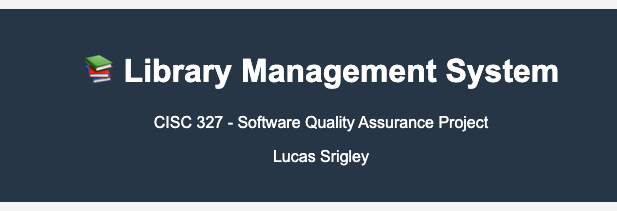

### Lucas Srigley
### 20289448

|Requirement | Function Name                     | Implementation Status |   Missing    |
|--|----------------------------------|-----------------------|--------------|
|R1| add_book_to_catalog()               |    Partial            |   Previously didn't check if ISBN is an integer (added check to see if ISBN string is an integer)          |
R2| get_all_books (database function)             |        Complete              |  Nothing missing.       |
|R3| borrow_book_by_patron()             |      Complete                 | Nothing missing.          |
|R4| return_book_by_patron()             |    Partial                 |               Function not implemented. |
|R5| calculate_late_fee_for_book()       |   Partial                   |  Function not implemented.         |
|R6| search_books_in_catalog()           |  Partial                     |    Function not implemented.           |
|R7| get_patron_status_report()          |   Partial                    |   Function not implemented.|

### req1_test.py

Validates if a user can add a new book to the list of catalogs. Checks if any input (title, author, isbn, total copies) is empty. For title and author, it also checks for character constraints (<= 200 for title, <=100 for author>). For ISBN, it also checks if ISBN is exactly 13 digits. I added an additional check in the add_book_to_catalog() to ensure that ISBN is an actual integer and then added a test for it.

### req2_test.py

Validates that the length of the input matches the get_all_books() result. It then checks to ensure that each input category matches the result before asserting true. It also validates the available/total copies count. 

### req3_test.py

Validates if the user can borrow a book by ensuring patron id and book id are correct. It also validates for book availability and patron borrowing limits.

### req4_test.py

Function not implemented, does not allow the user to return a book. Added validation checks for if the provided patron or book ids are invalid.

### req5_test.py

Function not implemented, does not calculate the late fee. Added validation checks for if the provided patron or book ids are invalid.

### req6_test.py

Function not implemented, does not allow the user to search for books. Added validation checks for if the search term or search type is empty. Also added check for if search_type is valid or not (has to be either title, author, or isbn).

### req7_test.py

Function not implemented, does not get status report for a patron. Added validation check for if patron id is invalid.